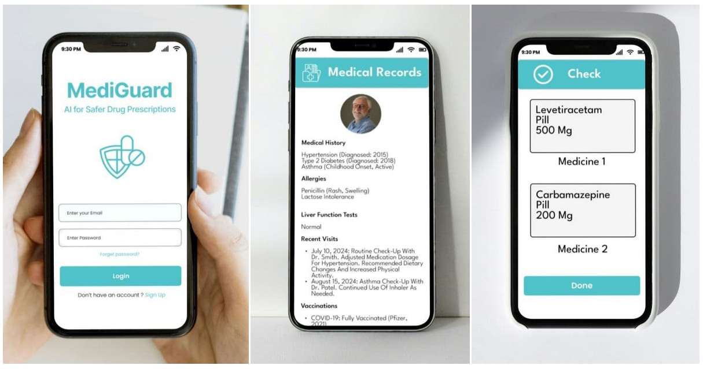

# Future Improvements 
 
While MediGuard currently provides essential medication compatibility checks, several enhancements can be introduced in future iterations to improve accuracy, expand functionality, and increase accessibility. Below are some potential areas of growth. 
 
## 1. Mobile Application Development 
 
Expanding MediGuard to mobile platforms (iOS and Android) would allow patients to access medication compatibility information on the go. Push notifications could also remind users about medication schedules, potential interactions, and new updates on their medical conditions. 
 
## 2. Barcode Scanning for Medication Compatibility 
 
A key feature we plan to implement in future versions of MediGuard is barcode scanning. This feature would allow users to scan the barcode of a medication directly through their device's camera, instantly checking its compatibility with the user's current medications and medical conditions. 
 
## 3. Integration with Electronic Health Records (EHR) Systems 
 
To streamline the process of importing patient data, MediGuard could be integrated with existing EHR systems. This would allow for real-time updates and accurate medical records, making the medication compatibility checks even more reliable. 
 
## 4. Advanced AI for Personalized Recommendations 
 
Implementing AI and machine learning algorithms could improve the accuracy of medication recommendations by analyzing large datasets of similar patient profiles and outcomes. This would help provide more personalized advice for patients with complex medical histories. 

## 5. User Interface Design

 
 
## Conclusion 
 
These future enhancements will significantly improve MediGuard's ability to help patients manage their medications safely and effectively, ultimately contributing to better health outcomes and a more user-friendly experience.

